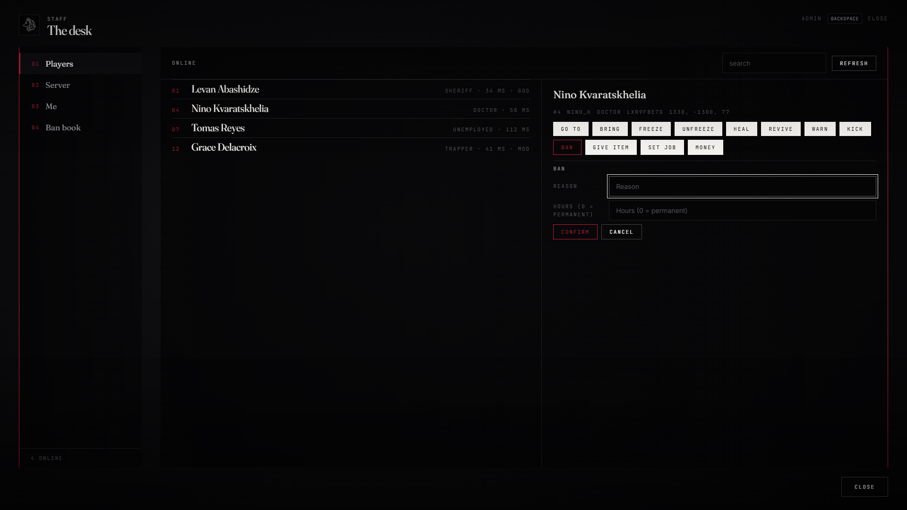

# lxr-admin — The staff desk, for LXRCore

A panel for staff on the LXR UI Kit: the players online, the server, your
own ped, and the ban book. Every action has a tier taken from the core's
permission groups, is checked on the server (the client only asks), and is
logged with who did what to whom.



## What it does

* **Players** — search, pick, act: go to, bring, freeze, heal, revive
  (through lxr-doctor when present), warn, kick, ban with hours, give item,
  set job, move money. Buttons only appear for actions your tier allows.
* **Server** — online count, uptime, sky and clock from lxr-weather;
  announce to everyone, set weather, set or freeze time.
* **Me** — no clip (`/noclip` too), godmode, invisible; teleport to the
  waypoint or to coordinates. Each switch is confirmed and logged by the
  server first.
* **Ban book** — the core's `bans` table, newest first; lift a ban.
* **Tiers** — `Config.Access` maps every action to a group from
  `Config.Server.permissions`; a tier includes every group above it.
* **Events** — `lxr:admin:action (src, action, target, detail)`; the core
  log line `admin`.

## Install

```cfg
ensure lxr-core
ensure lxr-admin
```

Open with `/admin` or the key in `Config.Command.key` (F10 by default;
players can rebind it in the game settings).

## API

| Name | Side | Purpose |
|---|---|---|
| `May(src, action)` | server | the tier check, for other resources |
| `Players()` | server | the player list the panel shows |
| `IsOpen()` · `Tools()` | client | panel state; which self-tools are on |

## Licence

© 2026 iBoss21 / LXRCore — All Rights Reserved. See `LICENSE`.
